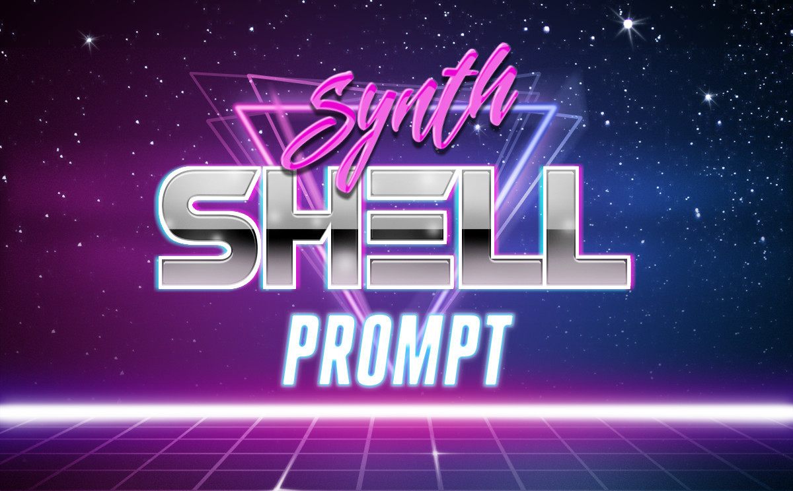

This script is part of [synth-shell](https://github.com/andresgongora/synth-shell)

**synth-shell-prompt** is not only fancy, but also useful:
- Configurable colors and aesthetics.
- Git statuses (requires pull/push, is dirty, etc.) if inside a directory that
  is part of a git repository.
- Better separation between user input and command outputs.


<br/><br/>


<!--------------------------------------+-------------------------------------->
#                                     Setup
<!--------------------------------------+-------------------------------------->


### Arch Linux

You may install `synth-shell-prompt` from AUR: 
https://aur.archlinux.org/packages/synth-shell-prompt-git/
Once installed, test it with:
```
. /usr/bin/synth-shell-prompt
```
And if you like it, add it permanently to your terminal with:
```
echo ". /usr/bin/synth-shell-prompt" >> ~/.bashrc
```


### Manual setup

The included [setup script](setup.sh) will guide you step by step through the
installatioj process. Just clone this repository and run it:
```
git clone --recursive https://github.com/andresgongora/synth-shell-prompt.git
synth-shell-prompt/setup.sh
```

You can then test your script by sourcing it from wherever you installed it.
Usually this is to your user's `.config` folder, so you should run the following
command. Notice the `.`, this is meant to source the script to your
terminal session (i.e. include it into your session).
```
. ~/.config/synth-shell/synth-shell-prompt.sh
```

If you want it to appear everytime you open a new terminal, run either
```
echo ". ~/.config/synth-shell/synth-shell-prompt.sh" >> ~/.bashrc
```


### Configuration/customization
You can configure your scripts by modifying the corresponding configuration
files. You can find them, along example configuration files, in the following
folders depending on how you installed **synth-shell**:

* Current-user only: `~/.config/synth-shell/`
* System wide: `/etc/synth-shell/`


<br/><br/>


<!--------------------------------------+-------------------------------------->
#                                    Overview
<!--------------------------------------+-------------------------------------->

`fancy-bash-prompt.sh` Adds colors and triangular separators to your bash 
prompt, and if the current working directory is part of a git repository, 
also git statuses and branches.
For best results, consider installing (and telling your terminal to use) 
the `hack-ttf` font alongside the powerline-fonts (the later is required for
the separators).

As for the git status info, `fancy-bash-prompt.sh` prints an additional, fourth 
separator with the name of the current branch and one of the following icons
to indicate the state of the repository (can be changed in the config file):

|          Local-Upstream          | Local branch has no changes | Local branch is dirty |
|:--------------------------------:|:---------------------------:|:---------------------:|
|            Up to date            |                             |           □           |
|     Ahead (you have to push)     |              ▲              |           △           |
|     Behind (you have to pull)    |              ▼              |           ▽           |
| Diverged (you have to pull-push) |              ●              |           ○           |


<br/><br/>


<!--------------------------------------+-------------------------------------->
#                                   Contribute
<!--------------------------------------+-------------------------------------->

This project is only possible thanks to the effort and passion of many, 
including developers, testers, and of course, our beloved coffee machine.
You can find a detailed list of everyone involved in the development
in [AUTHORS.md](AUTHORS.md). Thanks to all of you!

If you like this project and want to contribute, you are most welcome to do so.


### Help us improve

* [Report a bug](https://github.com/andresgongora/synth-shell/issues/new/choose): 
  if you notice that something is not right, tell us. We'll try to fix it ASAP.
* Suggest an idea you would like to see in the next release: send us
  and email or open an [issue](https://github.com/andresgongora/synth-shell/issues)!
* Become a developer: fork this repo and become an active developer!
  Take a look at the [issues](https://github.com/andresgongora/synth-shell/issues)
  for suggestions of where to start. Also, take a look at our 
  [coding style](coding_style.md).
* Spread the word: telling your friends is the fastes way to get this code to
  the people who might enjoy it!


### Git branches

There are two branches in this repository:

* **master**: this is the main branch, and thus contains fully functional 
  scripts. When you want to use the scripts as a _user_, 
  this is the branch you want to clone or download.
* **develop**: this branch contains all the new features and most recent 
  contributions. It is always _stable_, in the sense that you can use it
  without major inconveniences. 
  However, it's very prone to undetected bugs and it might be subject to major
  unannounced changes. If you want to contribute, this is the branch 
  you should pull-request to.


<br/><br/>


<!--------------------------------------+-------------------------------------->
#                                     About
<!--------------------------------------+-------------------------------------->

**synth-shell-prompt** is part of
[synth-shell](https://github.com/andresgongora/synth-shell)


<br/><br/>


<!--------------------------------------+-------------------------------------->
#                                    License
<!--------------------------------------+-------------------------------------->

Copyright (c) 2014-2021, Andres Gongora - www.andresgongora.com

* This software is released under a GPLv3 license.
  Read [license-GPLv3.txt](LICENSE),
  or if not present, <http://www.gnu.org/licenses/>.
* If you need a closed-source version of this software
  for commercial purposes, please contact the [authors](AUTHORS.md).

